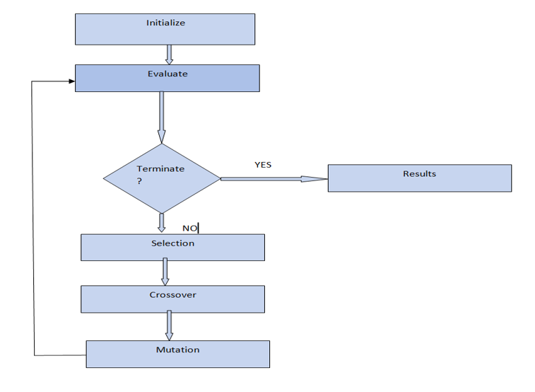
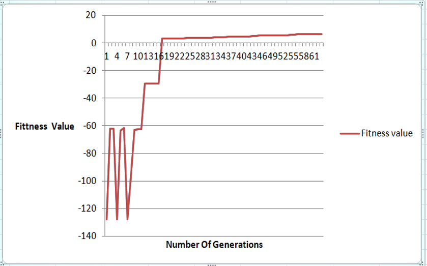
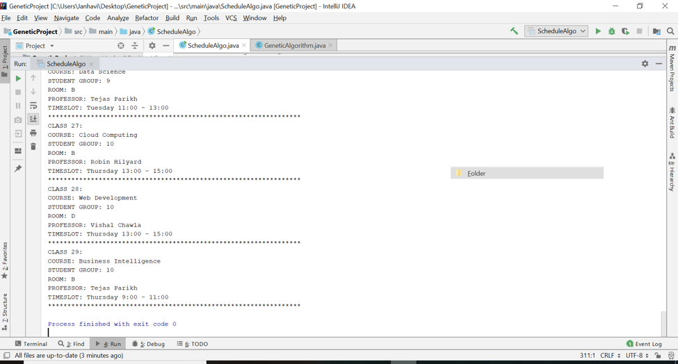
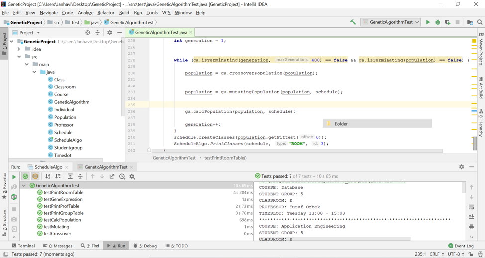

# Timetable Scheduler
> A genetic algorithm for scheduling university class timetable 

## Description
- Implemented a genetic algorithm for scheduling university class timetable with constraints.
- Designed algorithm using test driven design and incorporated parallel processing to optimize its performance.
- This is a variant of constraint satisfaction problem. In these type of problems,there is a set of variables that need to be assigned in a way that they avoid violating a set of constraints.
- While scheduling a timetable we have to consider many constraints. Like the classes should not clash or one professor cannot be in two places at the same time.

- Refer detailed report --> Genetic Algorithm Report.pdf
- Output data --> output.txt
## Screenshots
- Algorithm flowchart:

- Graph: Y-axis: Fitness Value; X-axis: Generations

- Unit tests:

## Technologies
- Java
- JUnit
- Maven
- IntelliJ IDEA

## Setup
1.    Clone repo/Download code
2.    Open folder in any IDE
3.    Run Unit Tests
4.    Run ScheduleAlgo 

## Contact
Feel free to contact me!
https://www.linkedin.com/in/janhavi-bhalerao/
